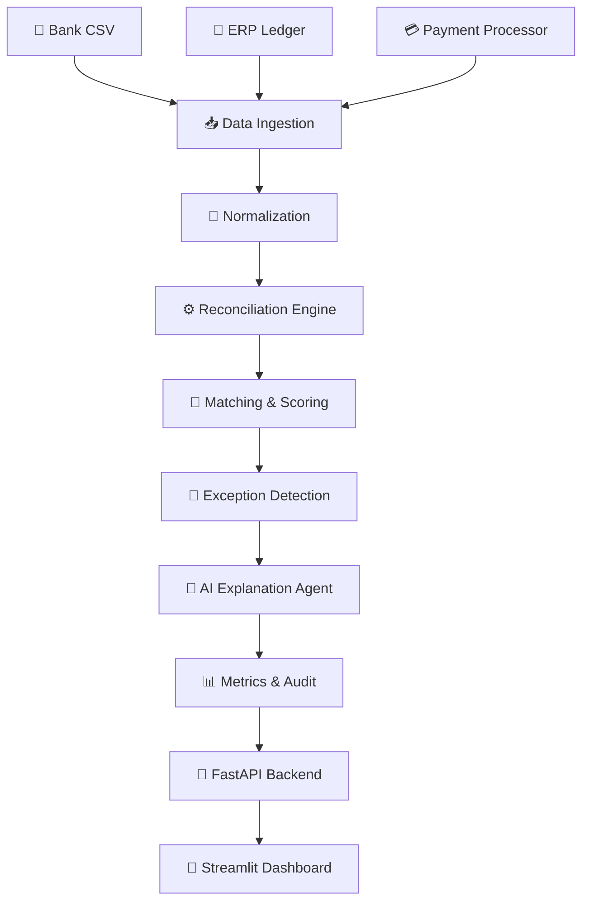

# 🏦 AI Finance Controller

**Autonomous reconciliation engine for finance operations** — an AI-powered agent that ingests multi-source financial data, reconciles transactions with deterministic + fuzzy matching, detects exceptions, and explains every decision.

> _"The AI doesn't pretend everything matches. It knows what it can reconcile and clearly identifies what needs a human."_

---

## 🎯 Problem

Finance teams spend thousands of hours manually reconciling transactions across bank statements, ERP systems, and payment processors. Discrepancies in amounts, dates, vendor names, and references create a reconciliation nightmare that costs organizations time, money, and audit risk.

## 💡 Solution

AI Finance Controller closes the finance-operations loop by:
1. **Ingesting** transactions from 3 synthetic financial sources
2. **Normalizing** dates, currencies, amounts, and entity names
3. **Reconciling** using exact + fuzzy matching with transparent weighted scoring
4. **Detecting** exceptions: amount mismatches, duplicates, missing records
5. **Explaining** every decision with human-readable reasoning
6. **Reporting** comprehensive metrics with an honest exception list

## ✨ Key Features

- 🔄 **Multi-source reconciliation** — Bank, ERP/Ledger, Payment Processor
- 🎯 **Deterministic matching** — Rule-based + RapidFuzz fuzzy matching
- 📊 **Transparent scoring** — Weighted multi-signal match scores
- 🚨 **Exception detection** — Amount, date, currency, duplicate, missing
- 🤖 **AI explanations** — Human-readable reasoning for every decision
- 📋 **Audit trail** — Full logging and decision transparency
- 📈 **Accuracy evaluation** — Ground truth comparison
- 🎨 **Interactive dashboard** — Professional Streamlit UI
- 🔌 **REST API** — FastAPI backend with full endpoint coverage
- 🐳 **Docker ready** — One-command deployment

## 🏗️ Architecture



## 🎯 Matching Algorithm

The reconciliation engine uses a transparent weighted scoring system:

| Signal | Weight | Method |
|--------|--------|--------|
| Reference/ID Similarity | 30% | RapidFuzz ratio |
| Amount Match | 30% | Percentage difference |
| Date Proximity | 15% | Day difference decay |
| Vendor/Merchant Similarity | 15% | RapidFuzz token sort ratio |
| Currency Match | 10% | Exact match |

### Match Classification

| Score | Status | Action |
|-------|--------|--------|
| ≥ 0.90 | ✅ MATCHED | Auto-reconciled |
| 0.75–0.89 | 🟡 LIKELY_MATCH | High confidence, flag for review |
| 0.50–0.74 | 🟠 MANUAL_REVIEW | Requires human verification |
| < 0.50 | 🔴 MISMATCH | Cannot reconcile |

Additional classifications: DUPLICATE (identical transactions), MISSING (no counterpart found).

## 📊 Synthetic Dataset

100+ deterministic synthetic records (seed=42) across three sources with intentional discrepancies:
- ✅ Exact matches
- 💰 Amount mismatches
- 📅 Date mismatches  
- 🔁 Duplicate transactions
- ❌ Missing records
- 🏢 Vendor name variations
- 🔢 Reference number variations
- 💱 Currency inconsistencies

A `ground_truth.csv` enables automated accuracy evaluation.

## 🚀 Quick Start

### Prerequisites
- Python 3.11+
- pip

### Installation

```bash
# Clone the repository
git clone https://github.com/yourusername/ai-finance-controller.git
cd ai-finance-controller

# Create virtual environment
python -m venv venv
source venv/bin/activate  # Windows: venv\Scripts\activate

# Install dependencies
pip install -r requirements.txt

# Configure environment
cp .env.example .env
```

### Generate Synthetic Data

```bash
python -m app.data.generator
```

### Run the Dashboard

```bash
streamlit run dashboard/streamlit_app.py
```
Open http://localhost:8501

### Run the API

```bash
uvicorn app.main:app --reload
```
Open http://localhost:8000/docs

### Run Tests

```bash
pytest -v
```

### Docker

```bash
docker compose up --build
```
- API: http://localhost:8000
- Dashboard: http://localhost:8501

## 🔌 API Endpoints

| Method | Endpoint | Description |
|--------|----------|-------------|
| GET | `/` | Welcome message |
| GET | `/health` | Health check |
| POST | `/reconcile` | Run reconciliation pipeline |
| GET | `/transactions` | Get all reconciliation results |
| GET | `/exceptions` | Get exception records only |
| GET | `/metrics` | Get reconciliation metrics |
| GET | `/transaction/{id}` | Get specific transaction detail |
| POST | `/generate-data` | Generate synthetic demo data |

### Example API Request

```bash
# Generate data
curl -X POST http://localhost:8000/generate-data

# Run reconciliation
curl -X POST http://localhost:8000/reconcile

# Get metrics
curl http://localhost:8000/metrics
```

## 🤖 AI Mode

The system works **without any API key** by default (`AI_MODE=local`).

| Mode | Description | API Key Required |
|------|-------------|------------------|
| `local` | Deterministic template-based explanations | ❌ No |
| `openai` | LLM-enhanced explanations and summaries | ✅ Yes |

To enable OpenAI mode:
```bash
# In .env
AI_MODE=openai
OPENAI_API_KEY=sk-your-key-here
```

**Important**: The core reconciliation logic is always deterministic. The LLM is only used for explanation text and summaries, never for financial matching decisions.

## 📁 Project Structure

```
ai-finance-controller/
├── app/
│   ├── __init__.py
│   ├── main.py              # FastAPI application
│   ├── api/
│   │   └── routes.py         # API endpoints
│   ├── core/
│   │   ├── config.py          # Configuration
│   │   └── logging.py         # Logging setup
│   ├── data/
│   │   ├── generator.py       # Synthetic data generator
│   │   ├── loader.py          # Data loading
│   │   ├── normalizer.py      # Data normalization
│   ├── reconciliation/
│   │   ├── engine.py          # Main reconciliation engine
│   │   ├── matcher.py         # Matching logic
│   │   ├── scorer.py          # Scoring engine
│   │   └── exceptions.py      # Exception detection
│   ├── agent/
│   │   ├── controller.py      # AI Finance Controller agent
│   │   └── explainer.py       # AI explanation agent
│   └── models/
│       └── schemas.py         # Pydantic models
├── dashboard/
│   └── streamlit_app.py       # Streamlit dashboard
├── data/                      # Generated CSV data
├── tests/                     # Pytest test suite
├── docs/                      # Documentation
├── requirements.txt
├── Dockerfile
├── docker-compose.yml
├── .env.example
├── .gitignore
├── LICENSE
└── README.md
```

## 🧪 Testing

```bash
# Run all tests
pytest -v

# Run specific test file
pytest tests/test_scorer.py -v

# Run with coverage
pytest --cov=app -v
```

## ⚠️ Limitations

- Uses **synthetic data** — not connected to real banking systems
- **Deterministic matching** — does not use ML models for matching
- **Optional LLM** — explanations are template-based by default
- **SQLite storage** — not suitable for production scale
- **Not production banking software** — for demonstration purposes only

## 🔮 Future Scope

- 🏦 ERP integrations (SAP, Oracle, NetSuite)
- 🔗 Bank API connections (Plaid, Yodlee)
- ⚡ Real-time settlement monitoring
- 👤 Human approval workflows
- 🔍 Anomaly detection with ML
- 💰 Cash flow forecasting
- 📋 Tax reconciliation
- 📊 Multi-currency FX handling

## 📄 License

MIT License — see [LICENSE](LICENSE)
