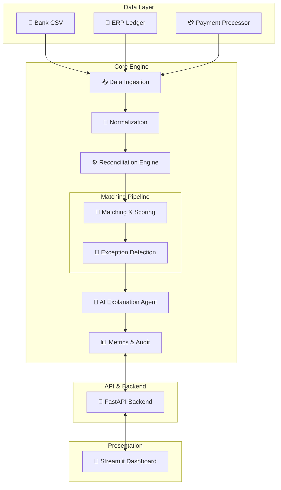

# Architecture: AI Finance Controller

This document outlines the architecture and core components of the AI Finance Controller project.

## 🏗️ System Overview

The AI Finance Controller is a standalone, deterministic reconciliation system designed to correlate financial records across multiple sources: Bank Statements, ERP Ledger, and Payment Gateways.

## 🧩 Core Components

1. **Data Ingestion & Normalization (`app/data/`)**:
   Reads diverse schema CSVs, normalizes date strings, cleans financial figures, and parses them into standardized `NormalizedTransaction` Pydantic models.

2. **Scoring Engine (`app/reconciliation/scorer.py`)**:
   Provides weighted similarity metrics to evaluate how closely two records match across multiple dimensions. Uses `rapidfuzz` for robust textual comparisons.

3. **Matcher (`app/reconciliation/matcher.py`)**:
   The engine that evaluates cross-source transaction pairs and groups. Applies the scoring engine and classifies results into status buckets (e.g., `MATCHED`, `LIKELY_MATCH`).

4. **Exception Handler (`app/reconciliation/exceptions.py`)**:
   Detects irregularities like duplications, missing counterparts in required ledgers, or stark amount/date mismatches between otherwise highly-correlated records.

5. **AI Controller (`app/agent/`)**:
   Generates human-readable, context-aware reasoning for the final reconciliation output. Uses strict template logic in `local` mode or LLMs when `OPENAI_API_KEY` is present.

## 🎯 Scoring & Matching Details

The heart of the application is a weighted scoring model:

- **30% - Reference Similarity**: Strongest signal. Compares invoice/transaction IDs.
- **30% - Amount Similarity**: Strict calculation based on percentage variance.
- **15% - Date Proximity**: Exponential decay based on days of difference.
- **15% - Vendor Similarity**: Fuzzy token-sort matching for varying entity names (e.g. "Acme Corp" vs "ACME CORPORATION").
- **10% - Currency**: Binary exact match validation.

When comparing a Bank record to a Ledger record, the overall score dictates the outcome. High confidence (≥0.90) is automated; medium confidence is flagged for review; mismatches are isolated.

## 🛡️ Exception Categories

1. **Amount Mismatch**: Score is high, but the exact figure differs significantly.
2. **Date Mismatch**: Settlement dates gap is outside standard banking windows.
3. **Missing Record**: Exists in Ledger/Payment but not recognized in the Bank statement.
4. **Duplicate**: Identical transaction hashes processed in the same time frame.
